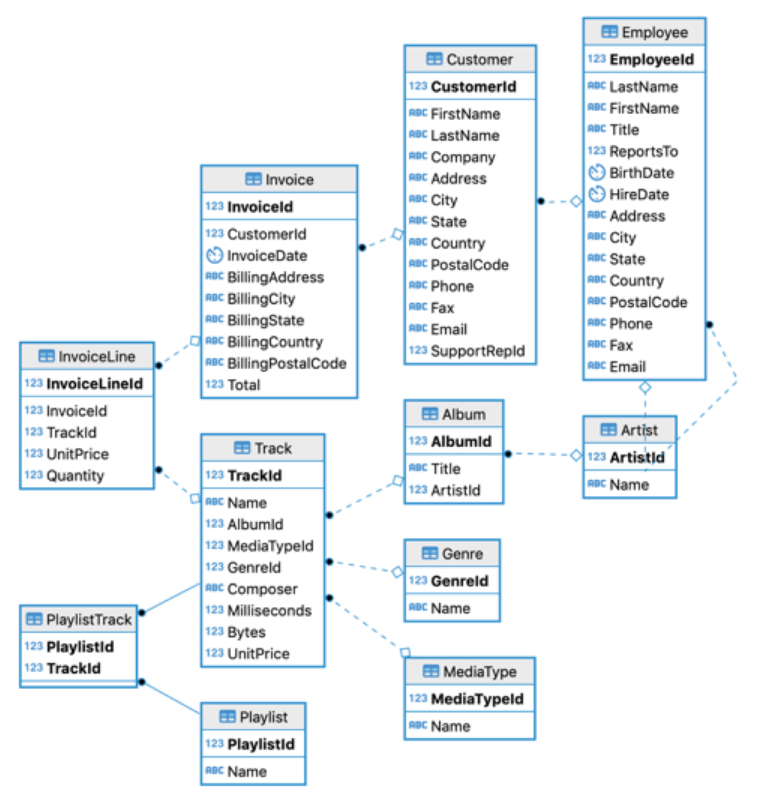

# Design, Modeling, and Building of Chinook Database

Design, Modeling, and Building of Chinook Database" refers to the process of designing, modeling, and implementing the Chinook database. The Chinook database is a widely used example for training and developing database applications, focusing on managing music-related data such as artists, albums, songs, and customers. This process involves designing the database schema, modeling the relationships between tables, and implementing the required structures and logic to ensure data efficiency and integrity.

The Chinook database is available for various database platforms, including PostgreSQL, MSSQL Server, Oracle, MySQL, and more. It can be created by running a single SQL script. However, here we will be doing it with a Python script in Jupyter Notebook. The Chinook database serves as an alternative to the Northwind database and is ideal for demos and testing ORM tools across both single and multiple database servers.

## Data Model
The Chinook data model represents a digital media store, containing tables for artists, albums, media tracks, invoices, and customers.

